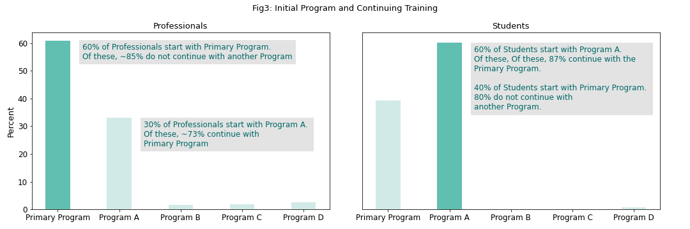

# 
eLearning User Data Analysis

### 
Project Background:

This project was undertaken on a probono basis for an eLearning Platform. Sample data was provided from ~ Nov 2019 to June 2022 for users associated with its largest corporate account. 

The client wanted to understand the learning patterns of these users and also if these patterns differed by type of user (professional vs student users). The client also had a flagship course which it expected attracted the corporate users to its platform initially. They wanted to understand if users stayed and pursued other courses.

### 
Key Observations:

<b> (1) Impact of the Primary Program </b>: Perhaps the most interesting observation is that, contrary to expectations, the first interaction that users have with the eLearning latform is not always via the Primary Program (flagship program). ~60% of students start with Ancillary Program A and ~40% of professional start one of the Ancillary Programs (predominantly Program A)

<b> (2) Continuing Education and Ancillary Program Popularity</b>: Most users are unfortunately not continuing beyond their initial Program. The exception are the students who start with Program A and continue with the Primary Program.
    
It is clear that amongst the ancillary learning programs that the platform is hoping to grow, Program A appears to be the standout and is popular amongst both students and prodessionals alike. In order to grow participation in the other Ancillary Programs, the recommended approach would be to conduct surveys and solicit feedback from users on what they like about Program A, e.g., topic covered, presentation, instruction style. All other Ancillary Programs would need to be reviewed against this feedback.

