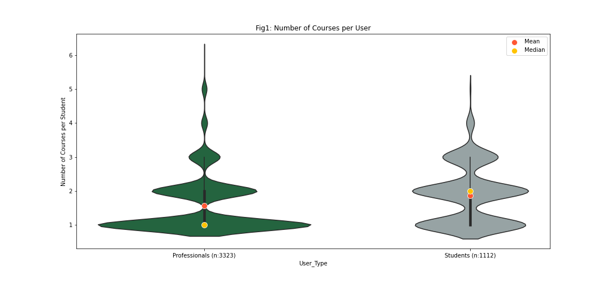
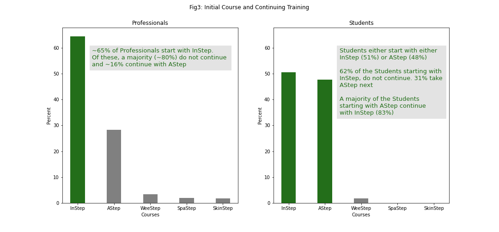

# 
Torrance Learning eLearning User Data Analysis

 UMich Portlab - Excerpt of Project Components Created by Riddhisha Prabu 

## 
 Executive Summary
 

Torrance Learning (TL) is vendor providing elearning training courses and webinars to a variety of clients. TL also provides learning content to students and 
professionals at the American Spinal Injury Association (ASIA). For this project TL, would like to obtain more information on the the course taking patterns for 
ASIA users.

An exploratory analysis of sample usage data from Nov 2019 to June 2022 showed: 

(1) <b> Number of Courses per User </b>: Most Professionals take ~1 course each while Students take closer to 2 courses. (See Fig. 1)

(2) <b> Course Popularity </b>: Torrance Learning's flagship InStep (International Standards 2019) course appears to be the most popular amongst students and professionals alike. This is followed by AStep (Autonomic Anatomy & Function) which appears more popular amongst professionals. (See Fig. 2)

(3) <b> Initial Courses and Continuing Training </b>: (See Fig. 3)
  * 65% of Professionals start with InStep. Of these, a majority (~80%) do not continue and ~16% continue with AStep
  * Students either start with either InStep (51%) or AStep (48%) 
    * 62% of the Students starting with InStep, do not continue. 31% take AStep next 
    * A majority of the Students starting with AStep continue with InStep (83%)

