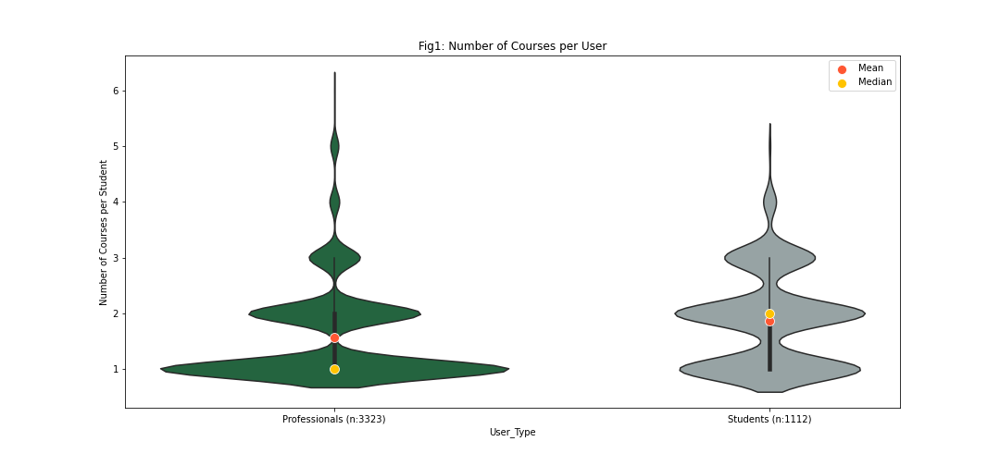
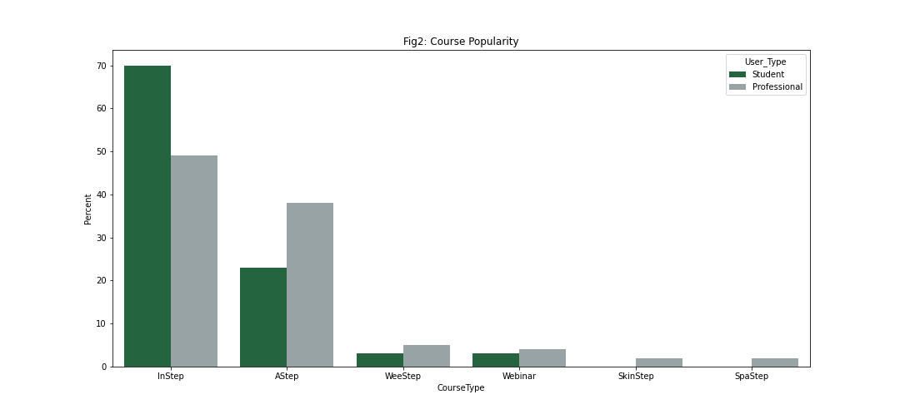
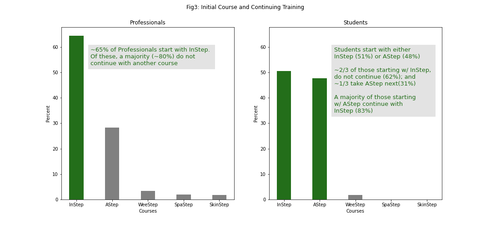

# 
Torrance Learning eLearning User Data Analysis

 UMich Portlab - Excerpt of Project Components Created by Riddhisha Prabu 

## 
 Executive Summary
 
Torrance Learning ("TL") provides elearning training courses and webinars to a variety of clients. For this project TL, would like to obtain more information on the the course taking patterns for one of its clients the American Spinal Injury Association ("ASIA").

### Observations Summary: 
The sample data provided by TL is a snapshot from ~ Nov 2019 to June 2022 and consists of ASIA professional users to student users in the ration ~3:1. Based on an exploratory analysis of sample data, the following observations can be made: 

(1) <b> Number of Courses per User </b>: Most Professionals take ~1 course each while Students take close to 2 courses. (See Fig. 1)

(2) <b> Course Popularity </b>: Torrance Learning's InStep (International Standards 2019) ands AStep Autonomic Anatomy & Function) courses appear to be the most popular amongst students and professionals alike. A majority of students take InStep (~70%) while for professionals, the distribution is more even (See Fig. 2)

(3) <b> Initial Courses and Continuing Training </b>: (See Fig. 3)
  * 65% of Professionals start with InStep and ~30% start with AStep.
      * A majority (~80%) of those starting with InStep do not continue

  * Students start with either InStep (51%) or AStep (48%) 
      * ~2/3 of the students starting with InStep, do not continue (62%) and ~1/3 take AStep next(31%) 
      * A majority of the Students starting with AStep continue with InStep (83%)

