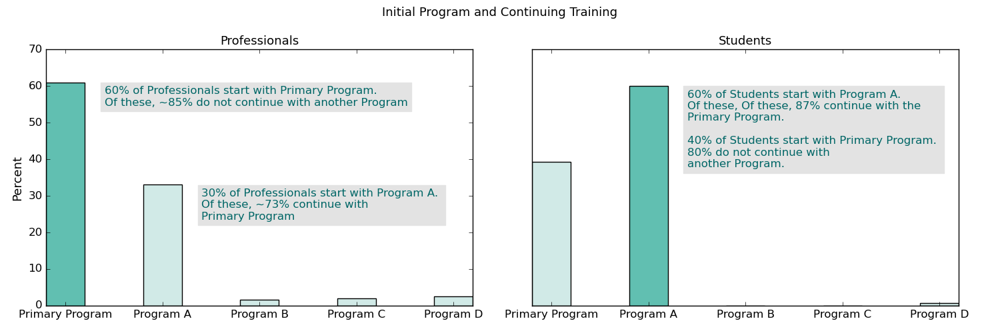
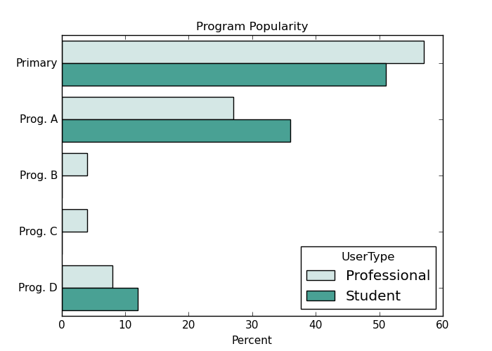

# 
eLearning User Data Analysis

### 
Project Background:

This project was undertaken on a pro bono basis for an eLearning Platform. The client offers a Flagship course which it expects attracts most users to its platform initially; they wanted to understand if users stayed beyond this course to pursue other courses (which would result in revenue generation or the platform). Further, the client also wanted to understand the general learning patterns of the users associated with its largest corporate account and also if these patterns differed by type of user (professional vs student users). 

Sample data was provided from ~ Nov 2019 to June 2022. 

### 
Key Observations:

<b> (1) Impact of the Flagship Program </b>: Perhaps the most interesting observation is that, contrary to expectations, the first interaction that users have with the eLearning platform is not always via the Flagship Program (also called Primary Program through this project). 

* Among student users, ~60% start with Ancillary Program A rather than the Flagship Program.
* The trend reverses amongst the professional users of the platform; about, while ~60% of such users do start with the Flagship program, a sizeable population (~40%) starts with one of the Ancillary Programs (predominantly Program A).

<b> (2) Continuing Education and Ancillary Program Popularity</b>: Most users are unfortunately not continuing beyond their initial Program. The exception are the students who start with Program A and continue with the Primary Program.
    
It is clear that amongst the ancillary learning programs that the platform is hoping to grow, Program A appears to be the standout and is popular amongst both students and professionals alike. In order to grow participation in the other Ancillary Programs, the recommended approach would be to conduct surveys and solicit feedback from users on what they like about Program A, e.g., topic covered, presentation, instruction style. All other Ancillary Programs would need to be reviewed against this feedback.

  

